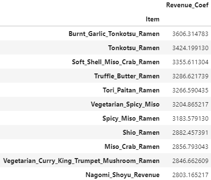
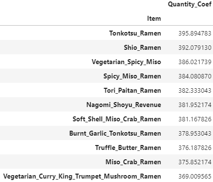

# PyRamen_Data_Analysis

## Problem

With Covid-19 rampaging through the United States and forcing restaurants to shut down temporarily, we decided it best to take this time to revisit our menu. We currently have 11 entrees and are looking to bring that number down to 8. Please give us your recommendation on what ramen dishes we should keep and which we should remove. Also please provide us with information on how we were doing before Covid-19 hit and what our numbers should look like when we return to normal business conditions. 

## Recommendation

After reviewing the sales data, I've come to the conclusion that the 3 items PyRamen should eliminate from their menu are the following:

 - Vegetarian Curry + King Trumpet Mushroom Ramen
 - Miso Crab Ramen
 - Nagomi Shoyu Ramen 

The first two recommendations, (Vegetarian Curry + King Trumpet Mushroom Ramen & Miso Crab Ramen), are entrees with the lowest rate of orders among customers. Since they weren't popular among the customers, it was safe to assume that they would be on the lower side of the revenue as well. To my surprise there was another entree that was lower than the two, Nagomi Shoyu. Nagomi Shoyu came in the middle of the pack as far as orders were concered, however due to the high cost of the entree and low profits generated; it was the third dish I recommended PyRamen eliminate from their menu. 

Revenue Coefficient             |  Quantity Coefficient
:-------------------------:|:-------------------------:
  |  

I've also created a [python script](Code/) that you can use to help analyze the finacials of your restaurant. After running the script it'll create a new [text document]() with all the information.

## Analysis

Below you'll see how the data came in.